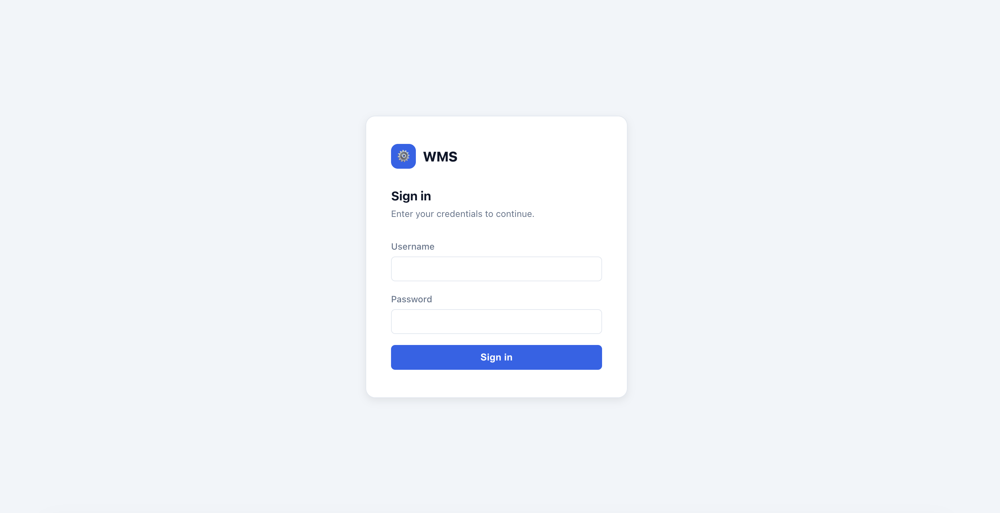
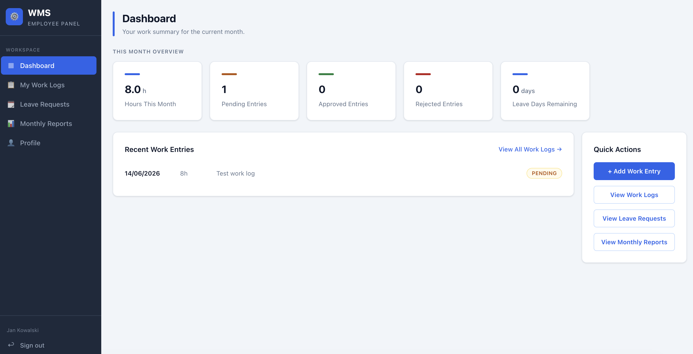
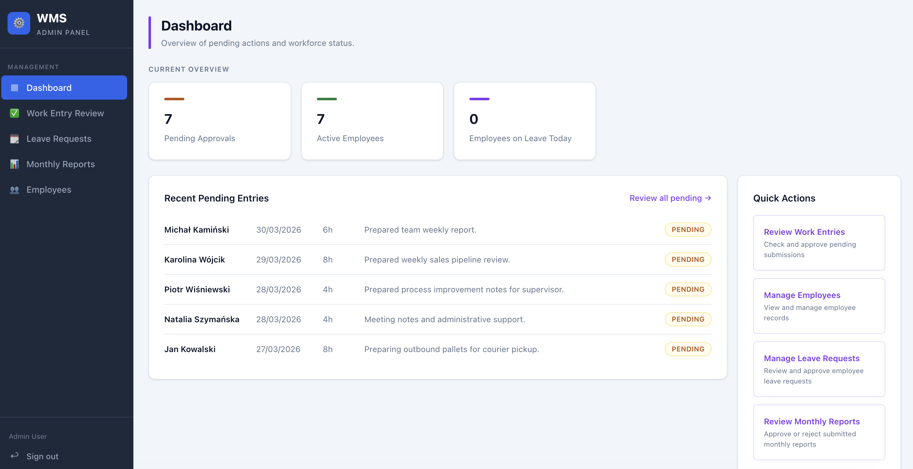

# WMS Backend

A Spring Boot REST API for managing employees, work time tracking, leave
requests and monthly work reports, secured with Keycloak (OAuth2 / JWT).

## Related Repositories

- **Frontend** -> [wms-frontend](https://github.com/bartwietecki/wms-frontend)
  (React, built with Vite)

## Project Overview

WMS is a small internal tool for tracking how employees spend their working
time and for managing time off.

- **EMPLOYEE** - logs work entries, requests leave, and submits monthly work
  reports for approval.
- **ADMIN** - manages the employee directory and reviews/approves work
  entries, leave requests and monthly reports.

Core features: work time tracking with an approval workflow, leave requests,
monthly work reports with PDF export, and role-specific dashboards.

## Architecture at a Glance

```
Frontend (React)
    │
    ▼
Keycloak                  - issues JWT access tokens (realm "wms",
    │                       roles ADMIN / EMPLOYEE)
    │  Authorization: Bearer <JWT>
    ▼
Spring Boot API           - OAuth2 Resource Server validates the JWT,
    │                        enforces role-based authorization
    ▼
PostgreSQL                - schema managed by Flyway
```

Internally, the API follows a standard layered structure **Controller ->
Service -> Repository** with DTOs at the API boundary and centralized
exception handling.

## Screenshots

### Login



### Employee Dashboard



### Admin Dashboard



## Features


### Employee Features

- can log and manage their own work entries/request leave,
- track their monthly hours on a dashboard,
- preview, submit and export (PDF) their monthly work reports.

### Admin Features

- manage the employee directory, 
- review and approve/reject work entries, leave requests and monthly reports,
- view aggregate dashboard metrics (pending approvals, active employees, employees on leave today).

## Technology Stack

| Category           | Technology |
|--------------------|------------|
| Language / runtime | Java 21 |
| Framework          | Spring Boot 4.0 (web, security, data-jpa, validation, actuator) |
| Security           | Spring Security, OAuth2 Resource Server (JWT) |
| Identity provider  | Keycloak 26 (realm-based, `ADMIN` / `EMPLOYEE` roles) |
| Database           | PostgreSQL 16 |
| Migrations         | Flyway |
| Persistence        | Spring Data JPA / Hibernate |
| Build tool         | Maven |
| Containerization   | Docker, Docker Compose |
| PDF generation     | OpenPDF |
| Testing            | JUnit 5, Mockito, AssertJ, MockMvc, Testcontainers |

## Design Decisions

A few notable choices made in this project:

- **JWT (Keycloak) over session-based auth** - the API is stateless
  (`SessionCreationPolicy.STATELESS`) and validates Keycloak-issued JWTs via
  Spring's OAuth2 Resource Server.
- **Flyway over Hibernate schema generation** - `ddl-auto: validate` plus
  versioned SQL migrations (`V1`-`V9`) keep schema changes explicit and
  reviewable.
- **`CurrentUserService` for identity** - maps the authenticated principal
  (JWT `preferred_username`) to the corresponding `Employee`, decoupling auth
  identity from the domain profile.
- **Removed client-supplied employee IDs** - endpoints used to accept an
  `X-EMPLOYEE-ID` header; identity is now derived solely from the
  authenticated principal, closing an IDOR-style vector.
- **Layered architecture** - Controller -> Service -> Repository -> DTO,
  keeping business rules and ownership checks centralized and unit-testable.

## Testing

- **Unit tests** (Mockito) for services and controllers.
- **Integration tests** (Spring Boot Test + MockMvc) against a real
  **Testcontainers PostgreSQL** instance, covering the full
  controller -> service -> repository -> database path.
- **Security tests** for `401`/`403` responses on missing auth or
  insufficient roles.
- **Ownership tests** verifying employees can't access each other's data.

CI runs the full suite on every push via GitHub Actions.

## Running with Docker

The full stack (PostgreSQL, Keycloak, this backend, and the
[frontend](https://github.com/bartwietecki/wms-frontend)) is defined in
`docker-compose.yml`:

```bash
cp .env.example .env
docker compose up -d --build
```

Keycloak is seeded with a demo realm and accounts for local development (see `keycloak/README.md`)

For local development without Docker, start PostgreSQL and Keycloak with
`docker compose up -d postgres keycloak`, then run the backend with
`./mvnw spring-boot:run` (Flyway applies migrations automatically).

A production overlay (`docker-compose.prod.yml`) disables the demo realm
import and activates the `prod` Spring profile.